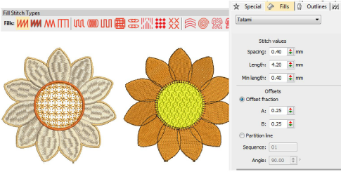
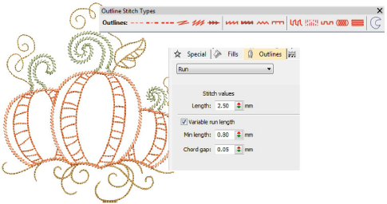

# Stitch types

The Stitch Types toolbars provide a range of basic outline and fill stitch types as well as those of a more artistic or decorative kind. Left-click icons to select stitch type. Right-click to access stitch settings. The Object Properties > Fills tab lets you specify values for the full range of fill stitch types.

The Object Properties > Outlines tab lets you specify values for the full range of outline stitch types.

## Related video

<iframe src="https://www.youtube.com/embed/tMk3ajMymNI" frameborder="0" 
		 allow="accelerometer; autoplay; encrypted-media; gyroscope; picture-in-picture" 
		 allowfullscreen="" style="width: 560px; height: 315px;">

&#160;

</iframe>

## Related video

<iframe src="https://www.youtube.com/embed/auPiwxVFQW8" frameborder="0" 
		 allow="accelerometer; autoplay; encrypted-media; gyroscope; picture-in-picture" 
		 allowfullscreen="" style="width: 560px; height: 315px;">

&#160;

</iframe>

## Related topics

- [Satin stitching](Satin_stitching)
- [Tatami stitching](Tatami_stitching)
- [Open stitching](Open_stitching)
- [Chenille-style patterns](Chenille-style_patterns)
- [String stitching](String_stitching)
- [Patterned stitching](Patterned_stitching)
- [Contoured fills](Contoured_fills)
- [Spiral fills](Spiral_fills)
- [Maze fills](Maze_fills)
- [Offset fills](Offset_fills)
- [Cross stitch fills](Cross_stitch_fills)
- [Stipple fills](Stipple_fills)
