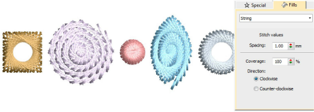

# String stitching

|            | Use Fill Stitch Types > String to create string craftstitch fills. Apply to closed shapes.                                    |
| ------------------------------------------ | ----------------------------------------------------------------------------------------------------------------------------- |
|  | Use Outline Stitch Types > String to create string craftstitch outlines for delicate borders. Apply to open or closed shapes. |

String stitch type is ideally suited creating craftstitch fills as well as delicate borders. It can, for instance, be used as a border for fixing ornamental mirrors and sequins. Apply to open or closed shapes. Settings can be accessed via Object Properties > Outlines and Object Properties > Fills tabs. String outline provides spacing and chord length settings for control of outline thickness and density. String fill provides a spacing setting for control of stitch density. Thickness is determined by the shape.

## Related video

<iframe src="https://www.youtube.com/embed/zPDSQd7C_ew" frameborder="0" 
		 allow="accelerometer; autoplay; encrypted-media; gyroscope; picture-in-picture" 
		 allowfullscreen="" style="width: 560px; height: 315px;">

</iframe>

## Related video

<iframe src="https://www.youtube.com/embed/eYHXO4BtP8U" frameborder="0" 
		 allow="accelerometer; autoplay; encrypted-media; gyroscope; picture-in-picture" 
		 allowfullscreen="" style="width: 560px; height: 315px;">

</iframe>

## Related topics

- [String stitching](../../Decorative/specialty/String_stitching)
