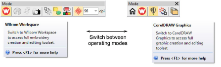
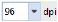

# Switch design windows

Open EmbroideryStudio using the desktop icon or the MS Windows® Start menu. The application has one workspace or ‘design window’ but you interact with it in different operating modes:

- CorelDRAW Graphics: This allows you to create and edit [embroidery objects](../../glossary/glossary#embroidery-objects) using an embroidery digitizing toolset.
- Wilcom Workspace: This allows you to create and edit [vector objects](../../glossary/glossary) using the CorelDRAW® Graphics Suite toolset.

## Display embroidery

|                      | Use Mode > Show Embroidery to show and hide embroidery objects in CorelDRAW Graphics.                               |
| -------------------------------------------------------------------- | ------------------------------------------------------------------------------------------------------------------- |
|  | Use Mode > Virtual Decoration Quality to set the rendering quality of embroidery TrueView for a virtual decoration. |

Artwork can be inserted, pasted or scanned into EmbroideryStudio for use as digitizing templates or ‘[backdrops](../../glossary/glossary)’. You can show or hide backdrops temporarily while you digitize. You can show or hide artwork temporarily in Wilcom Workspace. Conversely, in CorelDRAW Graphics, you have the option of turning on or off the embroidery display.

## Related topics

- [Operating modes](../../Basics/basics/Operating_modes)
- [Wilcom Workspace window](../../Basics/basics/Wilcom_Workspace_window)
- [CorelDRAW Graphics window](../../Basics/basics/CorelDRAW_Graphics_window)
- [Viewing design components](../../Basics/view/Viewing_design_components)
- [Output combined virtual embroidery & print](../../Applied/mixed/Output_combined_virtual_embroidery_print)
