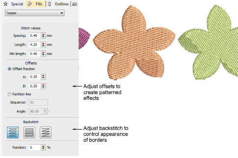

# Tatami stitching

|        | Use Fill Stitch Types > Tatami to create fills for larger irregular shapes. Right-click for settings.                   |
| ---------------------------------------------- | ----------------------------------------------------------------------------------------------------------------------- |
|  | Use Outline Stitch Types > Tatami to create borders or columns of even width for different needle penetration patterns. |

Tatami stitch consists of rows of run stitches and is suitable for filling large shapes. It can also be used to create borders or columns of even width for different needle penetration patterns. Settings can be accessed via Object Properties > Outlines and Object Properties > Fills tabs.

## Related video

<iframe src="https://www.youtube.com/embed/4-RwGATLML8" frameborder="0" 
		 allow="accelerometer; autoplay; encrypted-media; gyroscope; picture-in-picture" 
		 allowfullscreen="" style="width: 560px; height: 315px;">
</iframe>

## Related video

<iframe src="https://www.youtube.com/embed/qGkIuSS5Bk0" frameborder="0" 
		 allow="accelerometer; autoplay; encrypted-media; gyroscope; picture-in-picture" 
		 allowfullscreen="" style="width: 560px; height: 315px;">
</iframe>

## Related topics

- [Access object properties](../../Basics/basics/Access_object_properties)
- [Tatami stitching](../../Digitizing/stitches/Tatami_stitching)
- [Tatami density](../../Digitizing/stitches/Tatami_density)
- [Other tatami settings](../../Digitizing/stitches/Other_tatami_settings)
- [Creating textures with tatami offsets](../../Decorative/patterns/Creating_textures_with_tatami_offsets)
- [Tatami lettering](../../Lettering/lettering_advanced/Applying_stitch_types_effects_to_lettering)
