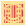
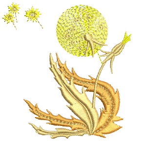

# User-defined splits

|  | Use Stitch Effects > User-Defined Split to create your own split line effects. Right-click to adjust settings. |
| ---------------------------------------------------- | -------------------------------------------------------------------------------------------------------------- |

The User-Defined Split function lets you add detail to filled objects by digitizing lines of needle penetrations called ‘split lines’. Split lines are stored as [object properties](../../glossary/glossary). They are preserved when stitches are regenerated even if you apply a different stitch type. Satin is the most suitable stitch type for User-Defined Split.

Note: For best results, digitize split lines approximately perpendicular to the stitch angle.

## Related video

<iframe src="https://www.youtube.com/embed/LaIjo38TuMM" frameborder="0" 
		 allow="accelerometer; autoplay; encrypted-media; gyroscope; picture-in-picture" 
		 allowfullscreen="" style="width: 560px; height: 315px;">

&#160;

</iframe>

## Related topics

- [User-defined splits](../../Decorative/patterns/User-defined_splits)
