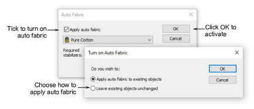

# Activate auto fabric

If you choose to apply an auto fabric to a design with no previous fabric, you are prompted to apply it to new objects only or to existing objects as well. predefined settings for the selected fabric will apply to all newly created objects in the design. They are also ‘intelligently’ applied to all embroidery objects already in the design. The selected fabric is displayed in the Status bar.

## Related topics

- [Open designs](../../Basics/basics/Open_designs)
- [Change fabrics](../../Digitizing/properties/Change_fabrics)
