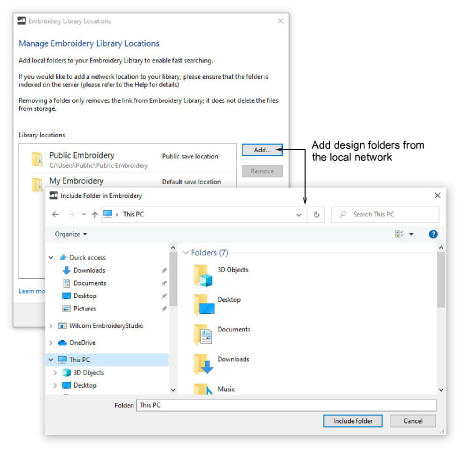

# Add folders to the library

|  | Use Manage Designs > Manage Embroidery Library Locations to add or remove existing folders from the Embroidery Library, enabling fast searching and filtering. |
| ------------------------------------------------------------------------------------ | -------------------------------------------------------------------------------------------------------------------------------------------------------------- |

Remember that the Design Library is a ‘virtual library’ in Windows. When you add or remove folders from the navigation pane, this only affects the Design Library. It does not affect the folder structure on your hard drive or network. To add design folders to your library, use the Manage Embroidery Library Locations function to locate folders containing designs anywhere on your local network.

## Related topics

- [Adding folders to the library](../../Management/manage_designs/Adding_folders_to_the_library)
- [Fast searching on shared network drives](../../Management/manage_designs/Fast_searching_on_shared_network_drives)
