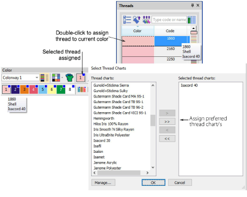

# Assign thread colors

|                          | Use Color > Threads to search for and match threads from different charts, and assign for use.                |
| ---------------------------------------------------------- | ------------------------------------------------------------------------------------------------------------- |
|  | Use Color > Colorway Editor to assign thread colors to slots in the color palette.                            |
|    | Use Threads > Select Thread Charts to select the thread chart/s you currently have available for use.         |
|                | Use Threads > Assign Thread to assign selected thread to the current color slot in the color palette.         |
|                        | Use Threads > Match All to match threads from the current chart/s to all color slots in the current colorway. |

The supplied charts represent the brands of threads that EmbroideryStudio supports. Each chart includes a range of thread colors together with code, brand and description. You can search for a thread by code or description and assign it to a selected design color slot. Alternatively, let the software match design colors to threads in the current thread chart/s.

Thread charts are lists of predefined thread colors. They may be based on commercially available thread charts, or charts you define yourself. When you create a thread chart, you are creating a store of colors for future use. You may also want to update existing thread charts by modifying thread details or removing threads.

## Related video

<iframe src="https://www.youtube.com/embed/YZ0NBwygIPg" frameborder="0" 
		 allow="accelerometer; autoplay; encrypted-media; gyroscope; picture-in-picture" 
		 allowfullscreen="" style="width: 560px; height: 315px;">

</iframe>

## Related video

<iframe src="https://www.youtube.com/embed/vVimtUEVxtw" frameborder="0" 
		 allow="accelerometer; autoplay; encrypted-media; gyroscope; picture-in-picture" 
		 allowfullscreen="" style="width: 560px; height: 315px;">

</iframe>

## Related topics

- [Assign thread colors](../../Basics/threads/Assign_thread_colors)
- [Create & modify thread charts](../../Basics/threads/Create_modify_thread_charts)
- [Copy colors between charts](../../Basics/threads/Copy_colors_between_charts)
