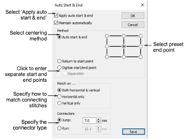

# Auto start & end points

|  | Use View > Auto Start & End to toggle the Auto Start & End function on/off according to the current settings. Right-click to adjust settings. |
| -------------------------------------------------- | --------------------------------------------------------------------------------------------------------------------------------------------- |

Before stitchout, some embroidery machines require you to position the hoop precisely in relation to the needle. The Auto Start & End feature is available to connect first and last stitches in a design. This makes it easy to position the needle before stitching, and reduces the chance of the needle hitting the side of the frame.

Note: Machines which auto-center designs around design extents will ignore the Auto Start & End setting.

## Related video

<iframe src="https://www.youtube.com/embed/CRgugihnLSc" frameborder="0" 
		 allow="accelerometer; autoplay; encrypted-media; gyroscope; picture-in-picture" 
		 allowfullscreen="" style="width: 560px; height: 315px;">

&#160;

</iframe>

## Related topics

- [Setting auto start & end](../../Production/hoops/Setting_auto_start_end)
- [Create layouts based on templates](../../Lettering/lettering_kiosk/Create_layouts_based_on_templates)
- [Selecting hoops manually](../../Production/hoops/Selecting_hoops_manually)
