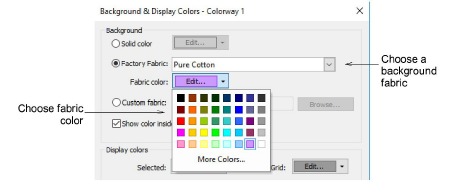

# Backgrounds & display colors

|  | Click Color > Background & Display Colors split arrow to change the background color of the current colorway. |
| ------------------------------------------------------------------ | ------------------------------------------------------------------------------------------------------------- |

EmbroideryStudio lets you set the background color of the current colorway for more realistic previews and presentations. Choose from an assortment of swatches, or if you have your own, import them into your design. Almost any artwork can be used – photos, magazine pictures, clipart images, and even fabric samples. The background is saved with the colorway.

## Related video

<iframe src="https://www.youtube.com/embed/cSBkrn-UWGQ" frameborder="0" 
		 allow="accelerometer; autoplay; encrypted-media; gyroscope; picture-in-picture" 
		 allowfullscreen="" style="width: 560px; height: 315px;">

</iframe>

## Related topics

- [Change backgrounds](../../Basics/view/Change_backgrounds)
- [Set fabric backgrounds](../../Digitizing/colorways/Set_fabric_backgrounds)
- [Fabric & product backgrounds](../../Digitizing/colorways/Fabric_product_backgrounds)
- [Change display colors](../../Basics/view/Change_display_colors)
