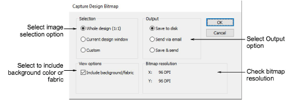

# Capture design bitmap

The Capture Design Bitmap dialog lets you save design images to disk or email them direct. This might be for stock design sales purposes, for approval of digitized designs, or for presentation on the web or in catalogs. The image can be captured as a [bitmap](../../glossary/glossary) with or without background color or fabric. It can be captured in TrueView™ or otherwise, and can include connectors, outlines and any other display options provided in EmbroideryStudio.

## Related topics

- [Outputting designs as images](../../Production/reports/Outputting_designs_as_images)
