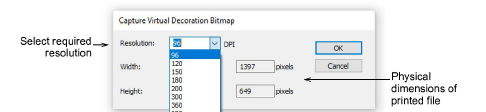

# Capture virtual decoration bitmap

EmbroideryStudio provides high resolution digital print TrueView for ‘virtual embroidery’. This is a technique that can provide commercial flexibility for embroiderers and direct-to-garment printers. Screen images are captured in PNG format because it supports transparency. Also all DTG printers use RIP (Raster Image Processor) software which uses PNG format.

## Related video

<iframe src="https://www.youtube.com/embed/SX1YtaXBt78" frameborder="0" 
		 allow="accelerometer; autoplay; encrypted-media; gyroscope; picture-in-picture" 
		 allowfullscreen="" style="width: 560px; height: 315px;">

&#160;

</iframe>

## Related video

<iframe src="https://www.youtube.com/embed/GUoG_8MiTZ0" frameborder="0" 
		 allow="accelerometer; autoplay; encrypted-media; gyroscope; picture-in-picture" 
		 allowfullscreen="" style="width: 560px; height: 315px;">

&#160;

</iframe>

## Related topics

- [Virtual embroidery](../../Applied/mixed/Virtual_embroidery)
- [Output embroidery as virtual decoration](../../Applied/mixed/Output_embroidery_as_virtual_decoration)
