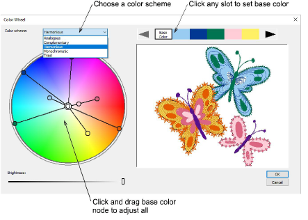

# Change color schemes

|  | Use Color > Cycle Used Colors to cycle through combinations of used colors. Right- or left-click. |
| -------------------------------------------------- | ------------------------------------------------------------------------------------------------- |
|            | Use Color > Color Wheel to access Color Wheel to test combinations of related colors.             |

The color tools allow you to quickly re-color entire designs. Their main purpose is to create new ‘[colorways](../../glossary/glossary#colorways)’ quickly and easily in order to ‘spice up’ old designs or place them on a different fabric.

## Related video

<iframe src="https://www.youtube.com/embed/FBLn06kpwZ4" frameborder="0" 
		 allow="accelerometer; autoplay; encrypted-media; gyroscope; picture-in-picture" 
		 allowfullscreen="" style="width: 560px; height: 315px;">

</iframe>

## Related topics

- [Change color schemes](../../Digitizing/colorways/Change_color_schemes)
