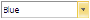
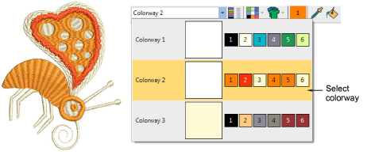

# Change colorways

|  | Use Color > Current Colorway dropdown to select a new color scheme for design. |
| -------------------------------------------------- | ------------------------------------------------------------------------------ |

A ‘colorway’ is a color scheme or palette of thread colors. It may also include a [background](../../glossary/glossary#background) color or fabric sample. In EmbroideryStudio, you can define multiple [colorways](../../glossary/glossary#colorways) for the one design. This means you can stitch out the same design in different colors on different fabrics. You can also print multiple colorways, icons of [color blocks](../../glossary/glossary), and design backgrounds with the [production worksheet](../../glossary/glossary#production-worksheet).

## Related topics

- [Switch colorways](../../Basics/view/Switch_colorways)
