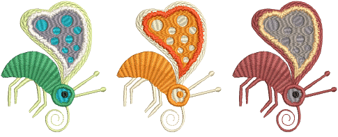

# Color palette

The Color toolbar contains a palette of thread colors specific to and only visible in Wilcom Workspace.

## Related topics

- [Edit thread colors](Edit_thread_colors)
- [Select thread colors](Select_thread_colors)
- [Split color blocks](Split_color_blocks)
- [Change color schemes](Change_color_schemes)
- [Assign thread colors](Assign_thread_colors)
- [Set color](Set_color)
