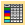
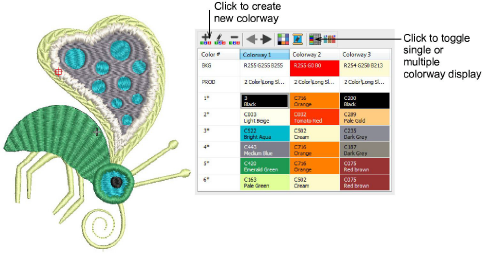
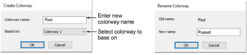
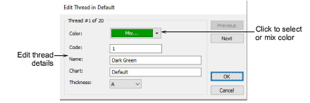

# Colorways

|                | Use Colorway Editor > Create Colorway to add a new colorway to the design.                                                     |
| -------------------------------------------------------------- | ------------------------------------------------------------------------------------------------------------------------------ |
|                | Use Colorway Editor > Delete Colorway to remove a colorway from the design.                                                    |
|                | Use Colorway Editor > Rename Colorway to rename selected colorway.                                                             |
|                    | Use Colorway Editor > Move Colorway Left/Right to move between colorways.                                                      |
|            | Use Colorway Editor > Background and Display Colors to change design background presets for the current colorway.              |
|                          | Use Colorway Editor > Edit Color to modify thread information about the palette color currently selected in the colorway list. |
|      | Use Colorway Editor > Show Colorway Details to show selected colorway details.                                                 |
|  | Use Colorway Editor > Hide Unused Colors to show or hide all unused colors in the color palette.                               |

When you create a new design, it contains a single default [colorway](../../glossary/glossary) called ‘Colorway 1’. You can add a virtually unlimited number of colorways to the design using the same or different thread sets. Preview designs in different colors on different fabrics. Colorways are saved with the design in [EMB](../../glossary/glossary) format. They can also be saved to an EMT template file for use in future designs. They cannot, however, be saved with machine files.

## Create colorways

The Create Colorway dialog lets you enter a name for new colorway. The Rename Colorway dialog lets you change the name of an existing colorway.

## Edit color

The Edit Color dialog lets you edit thread details.

## Related topics

- [Colorways](../../Digitizing/colorways/Colorways)
- [Creating colorways](../../Digitizing/colorways/Creating_colorways)
- [Add colorways](../../Digitizing/colorways/Add_colorways)
- [Color blocks & stop sequence](../../Digitizing/colorways/Color_blocks_stop_sequence)
- [Switch colorways](../../Basics/view/Switch_colorways)
- [View selected color blocks](../../Basics/view/View_selected_color_blocks)
- [Edit thread colors](../../Basics/threads/Edit_thread_colors)
- [Managing thread charts](../../Basics/threads/Managing_thread_charts)
