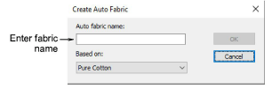
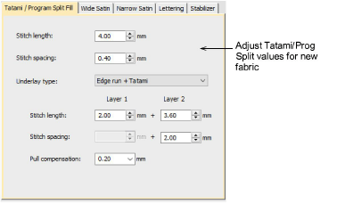
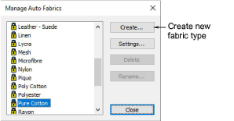

# Create auto fabrics

Use the Create Auto Fabric dialog to create a new fabric type.

## Auto fabric settings

In addition to predefined [fabric](../../glossary/glossary) settings, you can create your own custom fabric settings to suit particular needs using the Auto Fabric Settings dialog.

## Manage auto-fabrics

In addition to predefined [fabric](../../glossary/glossary) settings, you can create your own custom fabric settings to suit particular needs via the Manage Auto-Fabrics dialog.

## Related topics

- [Change fabrics](../../Digitizing/properties/Change_fabrics)
- [Manage fabrics](../../Digitizing/properties/Manage_fabrics)
