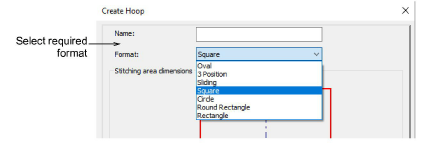
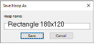

# Create hoop

If you are using a hoop size that is not in the hoop list, you can define your own hoops and save them for later use. You can create or edit various types of hoop – rectangular, oval, circle, square. You can, if you wish, define custom hoops to conform to the dimensions of any physically existing hoops you may be using. Various formats are available to define anything from rectangular, oval, circle, to square hoops. Each requires slightly different dimensions to be set.

## Save hoops

If you are using a hoop size that is not in the hoop list, you can define your own hoops and save them for later use. The Save Hoop As dialog lets you save your user-defined hoop together with system-defined hoops.

## Related topics

- [Define custom hoops](../../Production/hoops/Define_custom_hoops)
