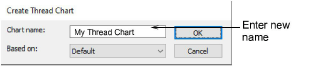
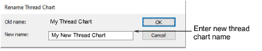
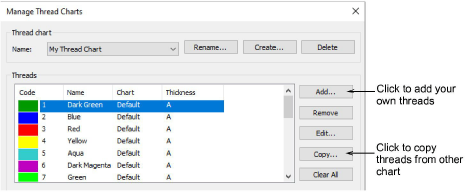
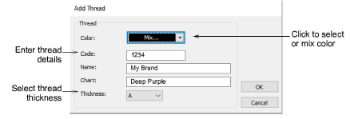
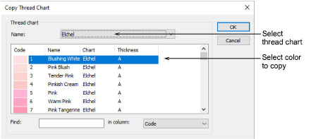

# Create thread charts

The Create Thread Chart dialog lets you name new thread chart.

## Rename thread chart

The Rename Thread Chart dialog lets you rename thread charts.

## Manage thread chart

The Manage Thread Chart dialog lets you create, rename and edit thread charts.

## Add thread

The Add Thread dialog lets you add threads to a thread chart. The Edit Thread dialog lets you edit thread details.

## Copy thread chart

The Copy Thread Chart dialog lets you copy threads from the other charts.

## Related topics

- [Create & modify thread charts](../../Basics/threads/Create_modify_thread_charts)
- [Copy colors between charts](../../Basics/threads/Copy_colors_between_charts)
- [Modify thread details](../../Basics/threads/Modify_thread_details)
