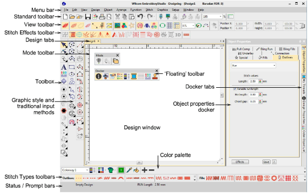

# Design Handling

You can access commands using buttons on the toolbars of your design window. To use a tool, simply move the mouse pointer over it, and click with the left mouse button.

## Related topics

- [Operating modes](Operating_modes)
- [Design management](Design_management)
- [Embroidery clipart](Embroidery_clipart)
- [Design information](Design_information)
- [Auto fabrics](Auto_fabrics)
- [Color palette](Color_palette)
- [Colorways & threads](Colorways_threads)
- [Machine formats](Machine_formats)
- [Design reading & writing](Design_reading_writing)
- [Design output](Design_output)
- [Design reports](Design_reports)
- [Hoops](Hoops)
- [Hardware setup](Hardware_setup)
- [System preferences](System_preferences)
