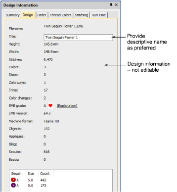

# Design information > Design

Select the Design tab to view design details such as height, width, stitch count and colors. The data is extracted from the design file and, apart from design title, cannot be modified.

## Related topics

- [Design tab](../../Management/manage_designs/Design_tab)
- [Output design information to CSV](../../Setup/hardware/Output_design_information_to_CSV)
