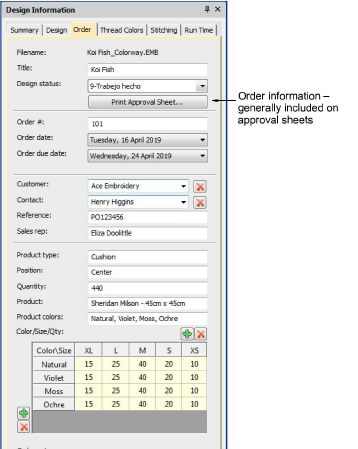

# Design information > Order

Order information is saved directly with the design file. This allows embroidery orders to be managed via the designs they use without the need for a commercial database. This information is generally included on approval sheets. For details, see topic on managing job orders.

## Related video

<iframe src="https://www.youtube.com/embed/S72SqNZ86qg" frameborder="0" 
		 allow="accelerometer; autoplay; encrypted-media; gyroscope; picture-in-picture" 
		 allowfullscreen="" style="width: 560px; height: 315px;">

</iframe>

## Related topics

- [Order tab](../../Management/manage_designs/Order_tab)
- [Managing quotes & orders](../../Management/manage_designs/Managing_quotes_orders)
