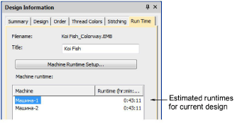

# Design information > Runtime

Once your machines have been defined, running times are displayed in the Design > Design Information dialog Runtime tab. This tab lists available machines together with estimated runtimes based on stitch count and machine criteria. Runtime estimate, based on selected machine, can also be included in the production worksheet.

## Related topics

- [Runtime tab](../../Management/manage_designs/Runtime_tab)
- [Doing runtime estimates](../../Setup/hardware/Doing_runtime_estimates)
- [Managing quotes & orders](../../Management/manage_designs/Managing_quotes_orders)
- [Output design information to CSV](../../Setup/hardware/Output_design_information_to_CSV)
