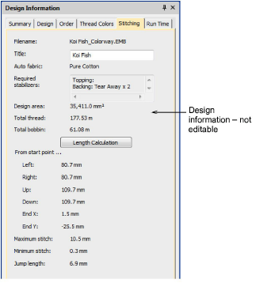

# Design information > Stitching

The Stitching tab displays technical stitching details mainly of use to machine operators. Information includes such details as target fabric, required stabilizers, as well as total thread estimates. These may be used for costings as well as production requirements.

## Related topics

- [Stitching tab](../../Management/manage_designs/Stitching_tab)
- [Thread usage estimates](../../Basics/threads/Thread_usage_estimates)
- [Working with fabrics](../../Digitizing/properties/Working_with_fabrics)
- [Manage fabrics](../../Digitizing/properties/Manage_fabrics)
- [Design Hooping](../../Production/hoops/Design_Hooping)
