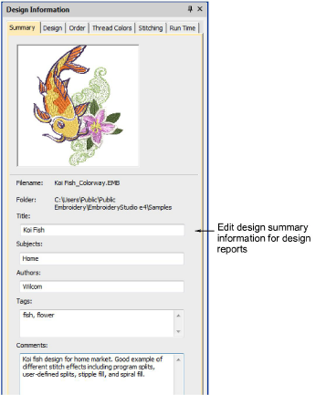

# Design information > Summary

Summary information about a design can be viewed and edited the Summary tab. Generally this information is used to improve searchability. Use the information to search and filter designs by author, title, or subject. Tags can be added to improve searchability. Information can be added in the docker itself or in the Details pane (if activated). Click Save to save details with the design file.

## Related topics

- [Viewing design information](../../Basics/view/Viewing_design_information)
- [Viewing & managing design information](../../Management/manage_designs/Viewing_managing_design_information)
- [Summary tab](../../Management/manage_designs/Summary_tab)
