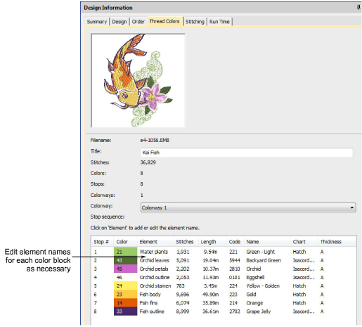

# Design information > Thread colors

The Thread Colors tab displays the color sequence and stitch counts for each design ‘element’. Elements equate to color changes. The tab also provides thread usage estimates which may be used for costings as well as production requirements.

## Related topics

- [Thread Colors tab](../../Management/manage_designs/Thread_Colors_tab)
- [Design thread colors](../../Digitizing/colorways/Design_thread_colors)
- [Name design elements](../../Digitizing/colorways/Name_design_elements)
- [Thread usage estimates](../../Basics/threads/Thread_usage_estimates)
- [Color blocks & stop sequence](../../Digitizing/colorways/Color_blocks_stop_sequence)
