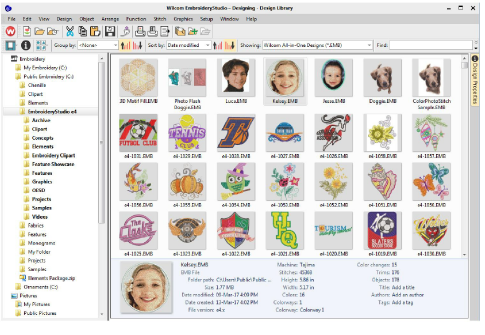

# Design management

|  | Click Mode > Design Library to open the Design Library window from which to search and catalogue designs and job orders. |
| -------------------------------------------------------- | ------------------------------------------------------------------------------------------------------------------------ |

Design Library is a design or job order management tool. Use it to browse design and artwork files stored on your local PC or company network. Design Library capabilities make it fast and practical for daily commercial use, avoiding the need to switch to and from File Explorer. It recognizes all file formats used by EmbroideryStudio.

Design Library is installed with sample designs in [EMB](../../glossary/glossary) format. These show various stitching techniques and effects, including ‘multi-decoration’ and multiple colorways. When starting out as a new user, make sure to spend time exploring these designs.

## Related video

<iframe src="https://www.youtube.com/embed/FDZ50HBWeic" frameborder="0" 
		 allow="accelerometer; autoplay; encrypted-media; gyroscope; picture-in-picture" 
		 allowfullscreen="" style="width: 560px; height: 315px;">

</iframe>

## Related video

<iframe src="https://www.youtube.com/embed/JTtDXIlOfGM" frameborder="0" 
		 allow="accelerometer; autoplay; encrypted-media; gyroscope; picture-in-picture" 
		 allowfullscreen="" style="width: 560px; height: 315px;">

</iframe>

## Related topics

- [View designs in network folders](View_designs_in_network_folders)
- [Open design files](Open_design_files)
- [Manage design information](Manage_design_information)
- [Convert designs](Convert_designs)
- [Send designs to machine](Send_designs_to_machine)
- [Print selected designs](Print_selected_designs)
- [Print design catalogs](Print_design_catalogs)
- [Export design lists](Export_design_lists)
- [Add folders to the library](Add_folders_to_the_library)
