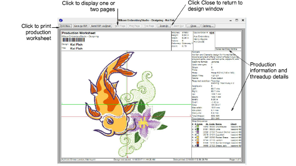
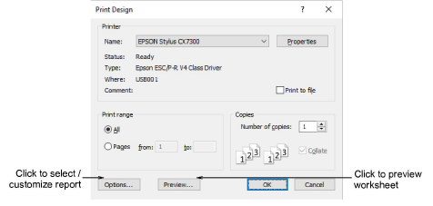
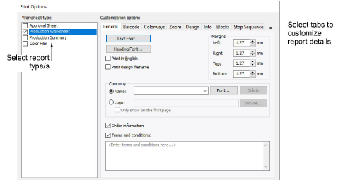

# Design reports

|                | Use Standard > Print to print production worksheets for the current design using the current settings. |
| -------------------------------------------- | ------------------------------------------------------------------------------------------------------ |
|  | Click Standard > Print Preview to preview the production worksheet on screen.                          |

The production worksheet is the link between designer and embroidery machine operator. It contains a design preview as well as essential production information, including design size, color sequence and special instructions.

## Print worksheets

Create a hard copy of the production worksheet using a printer or plotter. Set worksheet and printer options before you print, or use the current options.

## Print options

The Print Options dialog lets you set production worksheets options to show the information you want in the format you require. You can specify the data to print, graphics to include, zoom factor, and general options such as company name. You can use a color printer or a plotter to produce production worksheets. If you are using a color printer, you can print in TrueView™.

## Related video

<iframe src="https://www.youtube.com/embed/7yLV6Ei30VM" title="YouTube video player" 
		 frameborder="0" allow="accelerometer; autoplay; clipboard-write; encrypted-media; gyroscope; picture-in-picture; web-share" 
		 allowfullscreen="" style="width: 560px; height: 315px;">

&#160;

</iframe>

## Video recomendado

## Related topics

- [Printing design reports](../../Production/reports/Printing_design_reports)
- [Customizing design reports](../../Production/reports/Customizing_design_reports)
- [Print appliqué patterns](../../Applied/export/Print_appliqué_patterns)
