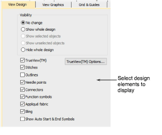
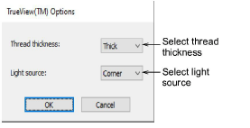

# Design viewing options

The Options dialog lets you adjust design window display settings. You can set your system to display all the embroidery objects in the design, or to hide all but the selected objects. You can also select what to show in design window such as stitches, outlines or needle points.

The Trueview Options dialog lets you set TrueView™ options to change thickness of the pictured thread, to specify the direction of the light source, and to set the maximum number of colors to use.

## Related topics

- [View selected objects](../../Basics/view/View_selected_objects)
- [Design viewing options](../../Setup/settings/Design_viewing_options)
