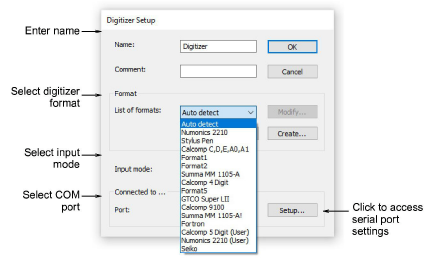
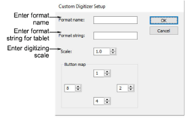

# Digitizer setup

The Digitizer Setup dialog lets you set up your digitizer tablet in EmbroideryStudio to define the required format and pointer display mode.

## Custom digitizer setup

The Custom Digitizer Setup dialog lets you create a new format, or modify an existing format.

## Related topics

- [Set up digitizing tablets](../../Setup/hardware/Set_up_digitizing_tablets)
- [Customize digitizing tablet formats](../../Setup/hardware/Customize_digitizing_tablet_formats)
