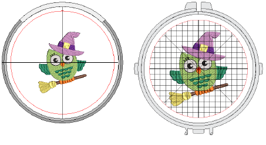

# Display hoops

|      | Click View > Show Hoop to turn hoop display on or off. Right-click to change hoop settings. |
| ---------------------------------------- | ------------------------------------------------------------------------------------------- |
|      | Click View > Auto Hoop to prompt the system to select a suitable hoop automatically.        |
|  | Click Zoom > Zoom To Hoop to view entire hoop in the design window.                         |

The Show Hoop tool allows you to toggle hoop display on or off. When activated, a hoop template representing the embroidery hoop you connect to your embroidery machine appears in the middle of the design window. The hoop can either be centered automatically at the design center or at a fixed position – i.e. center of the design window (default) or a user-defined center point.

The simplest way to hoop a design is to prompt the system to select a hoop for you. Auto Hoop finds the smallest hoop which can accommodate the entire design. Auto Hoop only selects hoops from the My Hoops list thus only ever suggesting a hoop you have pre-selected as available for use.

Tip: Click the Zoom to Hoop icon, select View > Zoom > Zoom to Hoop or press Alt+0 to view the entire hoop in the design window.

## Related topics

- [Setting up hoop lists](../../Production/hoops/Setting_up_hoop_lists)
- [Selecting hoops manually](../../Production/hoops/Selecting_hoops_manually)
- [Selecting hoops automatically](../../Production/hoops/Selecting_hoops_automatically)
- [Define custom hoops](../../Production/hoops/Define_custom_hoops)
