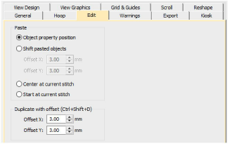

# Edit options

The Options dialog lets you specify values in regards to how you want the design window to look like while you are working. The Edit tab lets you set duplicate and paste options.

## Related video

<iframe src="https://www.youtube.com/embed/9J7fvGwlRwk" frameborder="0" 
		 allow="accelerometer; autoplay; encrypted-media; gyroscope; picture-in-picture" 
		 allowfullscreen="" style="width: 560px; height: 315px;">

&#160;

</iframe>

## Related topics

- [Paste & duplicate options](../../Setup/settings/Paste_duplicate_options)
