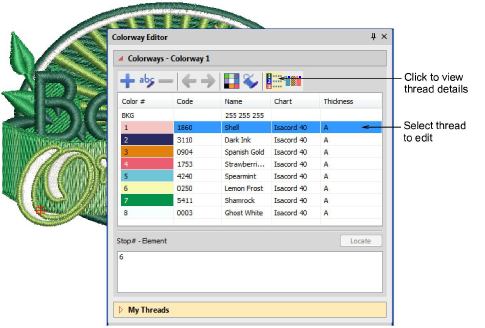

# Edit thread colors

|  | Use Color > Colorway Editor to modify threads in selected colorways. |
| ------------------------------------------------ | -------------------------------------------------------------------- |

You can always change code, name, chart, thickness or thread colors. For example, in Schiffli work, you may want to change text labels to Parts A, B and C to reflect the pattern arrangements when printing. These labels appear on the production worksheet both in the stop sequence and in Color Film printout. Alternatively, you may want to edit colors in a colorway before you assign actual threads.

## Related topics

- [View selected color blocks](../../Basics/view/View_selected_color_blocks)
- [Edit thread colors](../../Basics/threads/Edit_thread_colors)
- [Create & modify thread charts](../../Basics/threads/Create_modify_thread_charts)
- [Copy colors between charts](../../Basics/threads/Copy_colors_between_charts)
- [Modify thread details](../../Basics/threads/Modify_thread_details)
- [Add colorways](../../Digitizing/colorways/Add_colorways)
- [Name design elements](../../Digitizing/colorways/Name_design_elements)
- [Split color blocks](../../Digitizing/colorways/Split_color_blocks)
