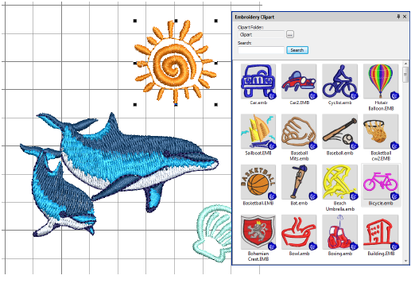

# Embroidery clipart

|  | Use Docker > Embroidery Clipart to toggle the docker display. Use it to record and recover re-usable embroidery elements. |
| ------------------------------------------------------ | ------------------------------------------------------------------------------------------------------------------------- |

The Embroidery Clipart feature is a powerful productivity tool which allows you to recycle commonly used elements. When you install EmbroideryStudio, the Embroidery Clipart feature is installed with Design Library together with a sample clipart library.

Use the Search functionality to filter your list according to name, keywords, number of colors, or number of stitches, etc. Once a suitable design element is located, simply drag-and-drop it as ‘embroidery clipart’ into the current project. Scale to suit the design. Stitch colors are added to the design Color palette.

## Related video

<iframe src="https://www.youtube.com/embed/QxbevflvCQE" frameborder="0" 
		 allow="accelerometer; autoplay; encrypted-media; gyroscope; picture-in-picture" 
		 allowfullscreen="" style="width: 560px; height: 315px;">

&#160;

</iframe>

## Related topics

- [Inserting designs with Embroidery Clipart](..\..\Management\manage designs\Inserting_designs_with_Embroidery Clipart)
- [Viewing & managing design information](../../Management/manage_designs/Viewing_managing_design_information)
- [Combining objects & designs](../../Modifying/combine/Combining_objects_designs)
- [Insert designs](../../Modifying/combine/Insert_designs)
