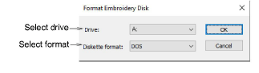
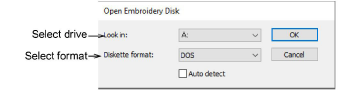
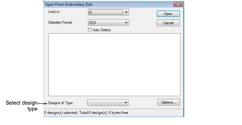
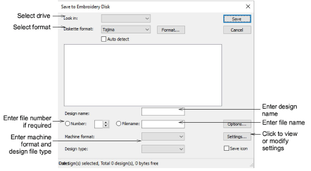

# Embroidery disks

|  | Use Legacy Features > Embroidery Disk to open designs from or save to proprietary embroidery disk formats. |
| ------------------------------------------------ | ---------------------------------------------------------------------------------------------------------- |

You can open designs of other formats from specially formatted 1.44 Mb DS/HD (Double-Sided High-Density) [embroidery disks](../../glossary/glossary). The Format Embroidery Disk dialog lets you format floppy disks in an embroidery format before you save designs to them.

The Open Embroidery Disk dialog lets you open designs from embroidery disk.

The Open From Embroidery Disk dialog lets you choose options for the file to open.

The Save to Embroidery Disk dialog lets you save designs to embroidery disks to stitch out on a specific machine.

## Related topics

- [Format embroidery disks](../../Production/output/Format_embroidery_disks)
- [Read designs from embroidery disk](../../Production/output/Read_designs_from_embroidery_disk)
- [Read designs from embroidery disk](../../Production/output/Read_designs_from_embroidery_disk)
- [Write designs to embroidery disk](../../Production/output/Write_designs_to_embroidery_disk)
