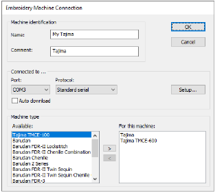

# Embroidery machine connection

The Embroidery Machine Connection dialog lets you configure the machine to the software. You can add machines, change settings for machines already set up, or delete machines that are no longer required.

## Related topics

- [Set up machines](../../Setup/hardware/Set_up_machines1)
