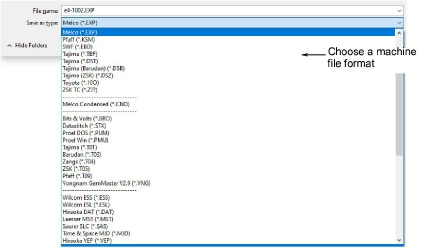

# Export machine files

|  | Use Standard > Export Machine File to export the current design to a machine file for stitching. |
| ------------------------------------------------------ | ------------------------------------------------------------------------------------------------ |

Converting an open design to machine file format is as simple as choosing File > Export Machine File. EmbroideryStudio reads and converts all popular formats.

Tip: For older machines, you can also save designs to proprietary [embroidery disk](../../glossary/glossary).

## Related video

<iframe src="https://www.youtube.com/embed/D00qxjDb5lQ" frameborder="0" 
		 allow="accelerometer; autoplay; clipboard-write; encrypted-media; gyroscope; picture-in-picture" 
		 allowfullscreen="" style="width: 560px; height: 315px;">

&#160;

</iframe>

## Related topics

- [Save & close designs](../../Basics/basics/Save_close_designs)
- [Exporting designs for machine](../../Production/output/Exporting_designs_for_machine)
- [Using embroidery disks](../../Production/output/Using_embroidery_disks)
