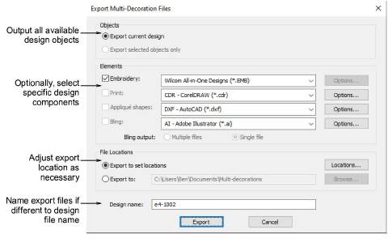
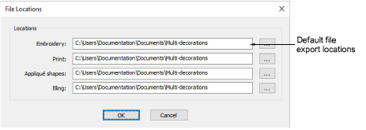

# Export multi-decoration files

|  | Use Standard > Export Multi-Decoration Files to export all design components requiring different production processes. |
| ------------------------------------------------------------------------ | ---------------------------------------------------------------------------------------------------------------------- |

The Export Multi-Decoration Files capability allows you to export the different file formats involved in a multi-decoration design with a single command option. The system recognizes whether a design component is embroidery, graphic, appliqué, or bling. It shows each component in an export dialog with a list of corresponding file types to choose from.

In some production environments, each file is placed in a specific location where it can be used by the operator of that process. For example, the Tajima Machine Network requires all files to be placed in a specific folder so they can be seen directly by the machine. Similarly, file formats used in any given process do not change unless the process changes – for example, if a machine is replaced.

## Related topics

- [Exporting multiple decoration files](../../Applied/export/Exporting_multiple_decoration_files)
- [Set export locations](../../Applied/export/Set_export_locations)
