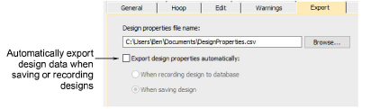

# Export options

Design information can be written whenever the design is saved or recorded to DesignWorkflow database. An Options > Export tab allows you to preset these options.

## Related topics

- [Export options](../../Setup/hardware/Output_design_information_to_CSV)
