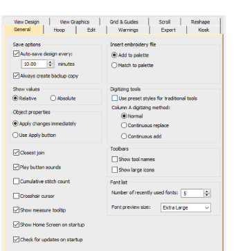

# General options

The Options dialog lets you specify values in regards to how you want the design window to look like while you are working. The General tab lets you set options for creating smooth joins in [Column A](../../glossary/glossary) objects. You can set pointer position display options as well as automatic save and backup options.

## Related topics

- [Create smooth joins](../../Digitizing/input/Create_smooth_joins)
- [Minimizing connectors](../../Quality/connectors/Minimizing_connectors)
- [Duplicate & clone objects](../../Modifying/combine/Duplicate_clone_objects)
- [Automatic save & backup options](../../Setup/settings/Automatic_save_backup_options)
- [Thread color handling for inserted files](../../Setup/settings/Thread_color_handling_for_inserted_files)
- [Pointer position display](../../Setup/settings/Pointer_position_display)
- [Paste & duplicate options](../../Setup/settings/Paste_duplicate_options)
- [Other general options](../../Setup/settings/Other_general_options)
