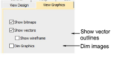

# Graphics viewing options

The Options dialog lets you adjust design window display settings. The View Graphics tab lets you to hide or dim a drawing temporarily to see the object outlines and stitches more clearly during digitizing.

## Related topics

- [Image viewing options](../../Setup/settings/Image_viewing_options)
