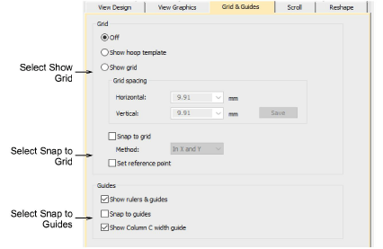

# Grid & guide options

The Options dialog lets you adjust design window Grid & Guides settings. The Grid and Guides tab lets you change grid values to adjust the distance between grid lines, align the grid with a specific point on the design, and to turn Snap to Grid on or off.

## Related topics

- [Grid display options](../../Setup/settings/Grid_display_options1)
- [Ruler & guide display options](../../Setup/settings/Ruler_guide_display_options)
