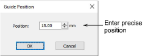

# Guide position

Guides are dotted vertical and horizontal lines placed across the design window to help you align objects. For more accurate positioning of guides, double-click the yellow handle. In the Guide Position dialog, enter a precise distance from the zero point, and click OK.

## Related topics

- [Display grids, rulers & guides](../../Basics/basics/Display_grids_rulers_guides)
