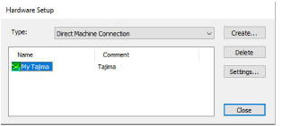

# Hardware setup

|  | Use Legacy Features > Hardware Setup to set up a machine connection with name, port, and protocol. |
| ---------------------------------------------- | -------------------------------------------------------------------------------------------------- |

Use the Hardware Setup dialog to set up your digitizer tablets, embroidery machines and monitor in EmbroideryStudio. To set up a machine you need to define a name, the port it is attached to, and the protocol it uses. For every machine, you need to select the [machine format](../../glossary/glossary) it supports.

## Related topics

- [Setting up machines for Stitch Manager](../../Setup/hardware/Setting_up_machines_for_Stitch_Manager)
- [Calibrating the monitor](../../Setup/hardware/Calibrating_the_monitor)
- [Set up digitizing tablets](../../Setup/hardware/Set_up_digitizing_tablets)
- [Serial ports](../../Setup/hardware/Peripheral_device_connections)
