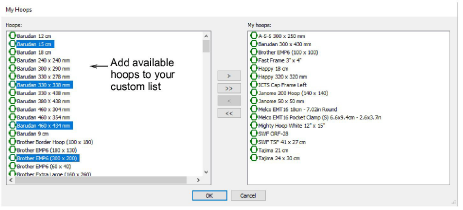
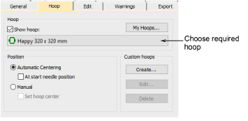

# Hoop setup

A range of commercial brands is available for a wide variety of design types. Configure the My Hoops list to include only those hoops you currently have available for use. If you are using a hoop that is not in the hoops list, you can define your own and save it for later use.

## My hoops

Configure the My Hoops list to include only those hoops you currently have available for use. This list can include commercial brands as well as your own custom-defined hoops.

## Hoop options

The Options > Hoop dialog lets you choose and set up your hoops.

## Related topics

- [Design Hooping](../../Production/hoops/Design_Hooping)
- [Setting up hoop lists](../../Production/hoops/Setting_up_hoop_lists)
