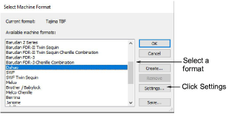
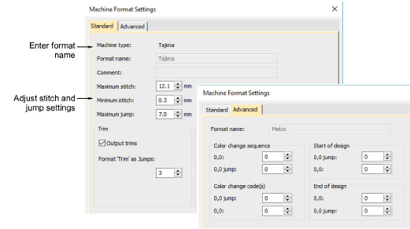

# Machine formats

Machine functions are instructions that tell your embroidery machine how to stitch a design. They tell the machine when to stop, change colors, trim a thread, jump, or put the needle in or out. The following dialogs all apply to the use of machine formats and functions in EmbroideryStudio.

Tip: Once a design is complete, you can stitch it out to any supported embroidery machine without changing design format. If a selected machine does not support a particular function included in the design, it is simply ignored.

## Select machine format

The Select Machine Format dialog lets you select an embroidery machine format when you create a design.

## Machine format settings

The Machine Format Settings dialog lets you specify the relevant values for the machine you selected. The Standard tab lets you set stitch and jump length, trim functions, color change functions and boring functions. The Advanced tab lets you set additional machine format options. The settings that are available depend on the machine format that is selected.

## Related topics

- [Embroidery machine formats](../../Basics/basics/Embroidery_machine_formats)
- [Standard machine formats](../../Setup/machines/Standard_machine_formats)
- [Advanced machine formats](../../Setup/machines/Advanced_machine_formats)
- [Custom machine formats](../../Setup/machines/Custom_machine_formats)
- [Select sequin-capable machines](../../Applied/sequin_basics/Select_sequin-capable_machines)
