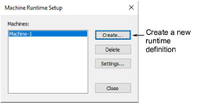
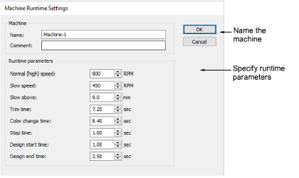

# Machine runtime setup

EmbroideryStudio provides a Runtime Analyst feature for calculating estimated running times for embroidery files using specified RPM values and other runtime parameters. These are used on a design-by-design basis to determine scheduling, running costs, and payments for production staff. Output can be used by any third-party software such as ERP or accounting systems.

## Machine runtime settings

EmbroideryStudio provides a Runtime Analyst feature for calculating estimated running times for embroidery files using specified RPM values and other runtime parameters. These are used on a design-by-design basis to determine scheduling, running costs, and payments for production staff. Output can be used by any third-party software such as ERP or accounting systems.

## Related topics

- [Configure machine runtime settings](../../Setup/hardware/Configure_machine_runtime_settings)
