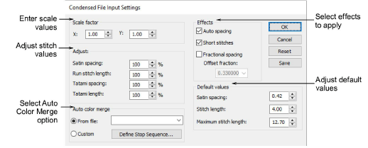
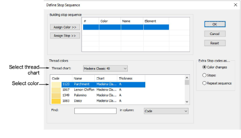
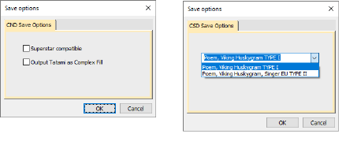

# Melco CND files

Melco Condensed (CND) is the native file format of the Melco embroidery digitizing software. CND files store only digitized outlines and stitch values.

## Condensed file input settings

When you open Melco CND files, the Melco stitch types used in the design are converted to EmbroideryStudio stitch types – Satin, Run, Tatami, etc. Use the Condensed File Input Settings dialog to change conversion settings in order to adjust the spacing, stitch length, effects and defaults applied to EmbroideryStudio stitch types. You can also set scaling values to open the design at a different size to the original.

## Define stop sequence

The Define Stop Sequence dialog lets you set custom settings for the Stop code when reassigning colors to stitch and Melco CND files.

## Save Melco files

The Save Options dialog lets you save files from EmbroideryStudio to Melco CND format. Files that were originally created in EmbroideryStudio generally give the best results, as other file types may not have all the information required for a successful conversion.

The CSD Save Option allows you to select between CSD Type I and Type II. Type II was introduced in CS 1.2B software for the POEM machine. It is also used by the singer EU software for the POEM machine. Type II CSD files additonally store the thread color RGB values and also an icon of the design.

## Related topics

- [Reassigning colors to machine files](../../Production/convert/Reassigning_colors_to_machine_files)
- [Reading Melco CND design files](../../Production/convert/Reading_Melco_CND_design_files)
- [Save designs in Melco CND format](../../Production/output/Save_designs_in_Melco_CND_format)
- [Save designs in Singer CSD format](../../Production/output/Save_designs_in_Singer_CSD_format)
