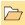
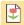
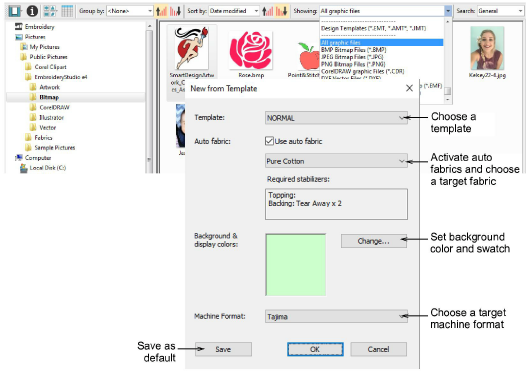

# Open design files

|        | Use Manage Designs > Open Selected to open design(s) selected in the embroidery library.                          |
| -------------------------------------------------- | ----------------------------------------------------------------------------------------------------------------- |
|  | Use Manage Designs > New From Selected to create new designs based on designs selected in the embroidery library. |

Design files, also known as ‘all-in-one’ or ‘outline’ files, are high-level formats which contain object outlines, [object properties](../../glossary/glossary#object-properties) and stitch data. When you open a design file in the software, corresponding stitch types, digitizing methods and effects are applied. Design files can be scaled, transformed and reshaped without affecting stitch density or quality. After modification, you can save to any supported file format.

Instead of opening the original designs, you can use New from Selected. The only difference for practical purposes is that this command creates a copy which opens in a new design tab, thus preserving the original design file. Left-clicking uses the default template. Right-clicking allows you to select a different template from the dialog. Selection is remembered and used the next time the command is invoked.

## Related topics

- [Opening design files](../../Management/manage_designs/Opening_design_files)
- [Opening new files from existing](../../Management/manage_designs/Opening_new_files_from_existing)
