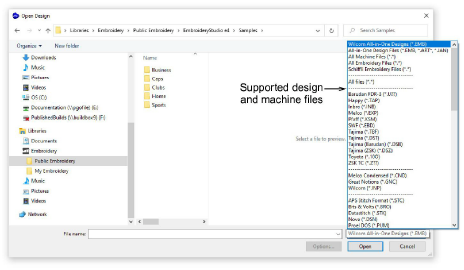

# Open designs

|                            | Use Standard > Open Design to open an existing design.                                      |
| ------------------------------------------------------ | ------------------------------------------------------------------------------------------- |
|  | Use Standard > Open Recent Designs to open a design from a list of recently opened designs. |

EmbroideryStudio opens a comprehensive range of both ‘[outline](../../glossary/glossary)’ and ‘[machine](../../glossary/glossary)’ files.

Tip: You can also open designs from proprietary [embroidery disks](../../glossary/glossary), or read them from paper tape.

## Related topics

- [Open designs](../../Basics/basics/Open_designs)
- [Create designs from templates](../../Basics/basics/Create_designs_from_templates)
- [Send designs as email attachments](../../Basics/basics/Send_designs_as_email_attachments)
- [Set up thread colors](../../Lettering/lettering_kiosk/Set_up_thread_colors)
- [Create new layouts from old](../../Lettering/lettering_kiosk/Create_new_layouts_from_old)
- [Reassigning colors to machine files](../../Production/convert/Reassigning_colors_to_machine_files)
- [Open machine files](../../Production/convert/Open_machine_files)
- [Read CND files with color-merge TXT file](../../Production/convert/Read_CND_files_with_color-merge_TXT_file)
